[[Home]](/index.md)
## A. User Experience Requirements:

          i. The Brainstorm Session:

            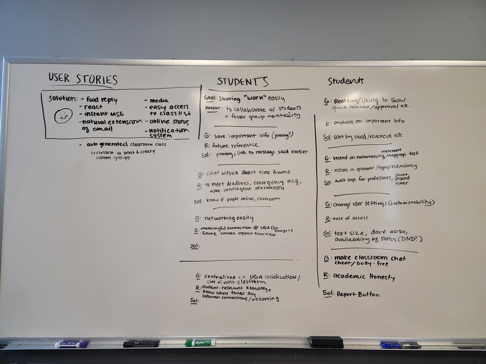
            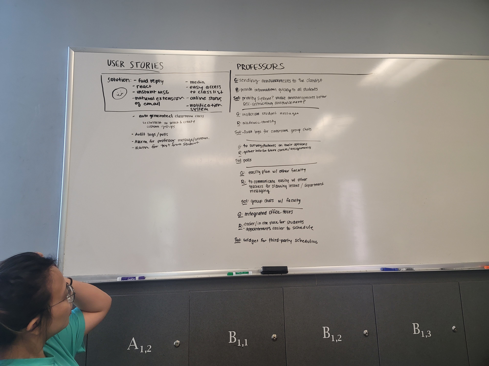
            

          1. User Story - Instant Messaging:

            The user we chose for this story is a student at UGA who wishes to use eLC to speak to another classmate within a smaller time frame, specifically to ask about time-sensitive information for a class. The reason why we wanted to tackle this is because of how commonplace instant messaging is, but this type of software is not within eLC’s system. Studies show that “Seventy percent of IM users reported logging into IM every time they are online” (Quan-Haase, “University Students”, 7). People find this type of messaging much more convenient for three reasons. Instant messaging is inexpensive and readily available, flexible (people can multitask) and allows for easy exits of conversation with less awkwardness (Quan-Haase, “University Students”, 17). 
             
            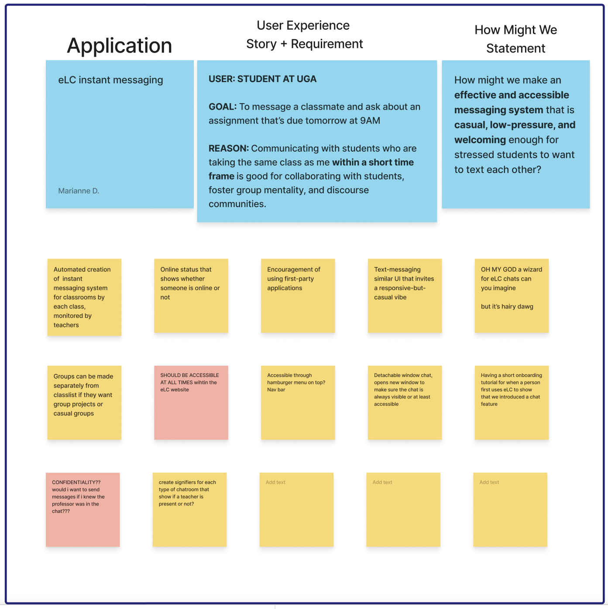

          2. User Story - Personalization & Settings:

            Our primary focus for this project was on the instant messaging feature in eLC, and we wanted to ensure the users could easily read and respond to messages.  Given that the user is most likely a student at UGA (or otherwise a professor/TA), we figured they would spend copious amounts of time sifting through the web application. While this is mostly true, we also knew from personal experience that very few—if any—students use the instant messaging feature on eLC; most students flock to GroupMe for peer-to-peer communication, so we realized there were some features existent in other IM applications that are lacking from eLC. 
             
            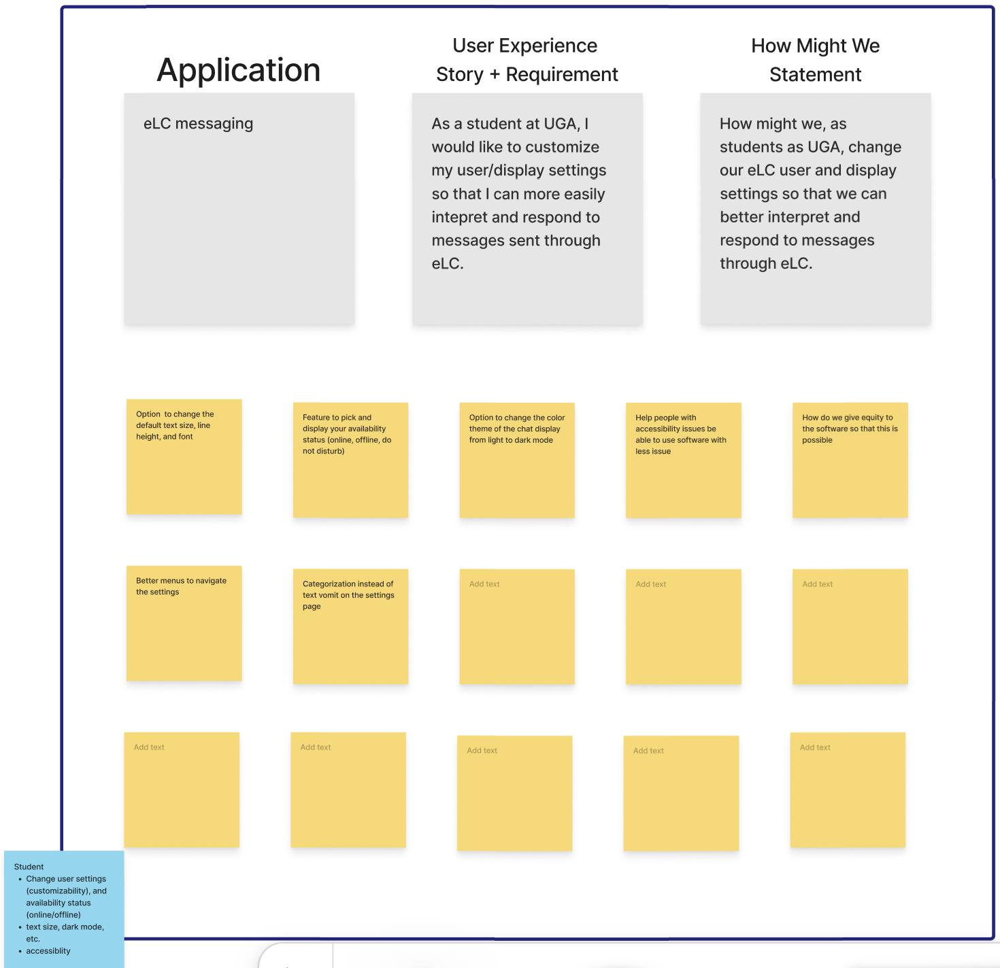

          3. User Story - Pinning & Marking Messages:

            We picked reacting to and finding popular and pinned (important messages). We felt like this was an important user story because if the elc messenger is used as an online community for class, important messages could be hard to find. We could not find research into the effectiveness of pinned messages but the fact that most major group messaging services and modern forums have. This list includes Discord, Slack, WhatsApp, Reddit, and Piazza. 
             
            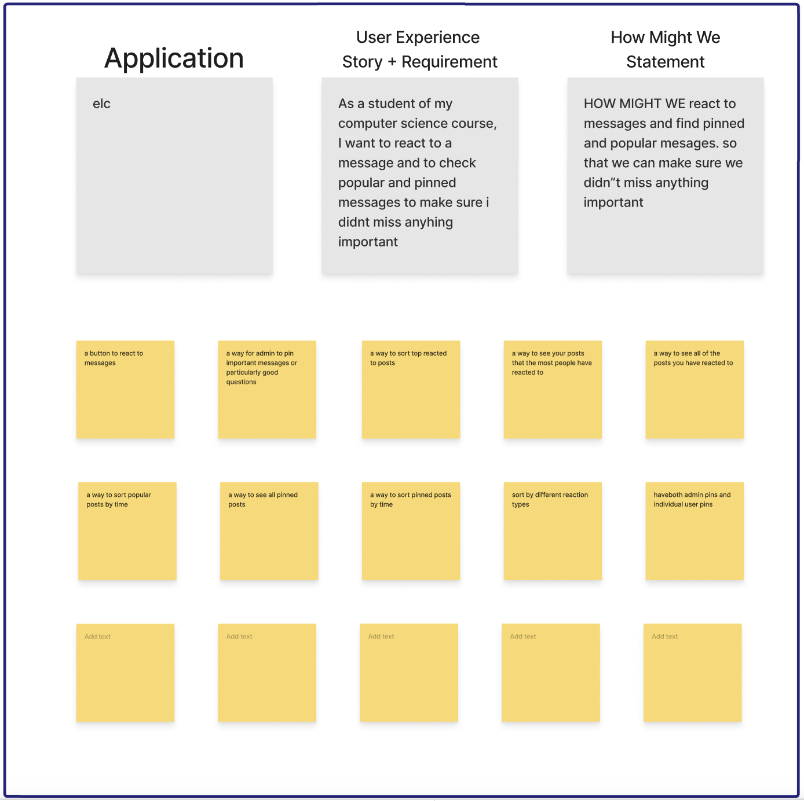

          4. User Story - Communicating with the Instructors:

            We decided to pick the user story about the professor having a disconnect with the students, because one of the main functions on eLC is for the instructors of the class to be able to adequately communicate with students in terms of scheduling office hours and answering to questions in a way that’s easy for both the professor and the student. It’s very evident that there is a real issue when it comes to communication between the professor and student, because many instructors are resorting to using alternative platforms for communication. One example is Figure 1, where on a syllabus posted on eLC by a professor of the CSCI department at UGA specifies that any questions will be addressed through email, and office hours scheduled through Calendly, a third party scheduling platform, rather than through eLC. Another example is Figure 2, where Piazza is used for sending forum style questions for professors, TAs, and peers alike to answer. 
             
            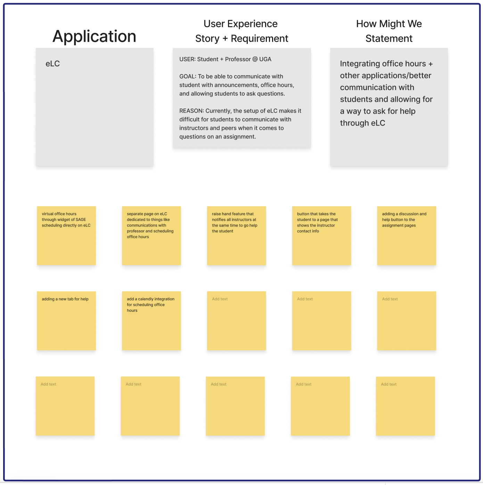

## B. Ideation and Preliminary Designs:

          1. User Story - Instant Messaging:

            The issue we encountered with the original Instant Messaging in eLC is the fact that it was incredibly inaccessible and people didn’t know it existed. The layout for it was incredibly hard to navigate and poorly designed. In this user story we particularly focused on points of access from the home page, and how we could access the messages page from all over the website. This is because Instant messaging cannot be instant messaging without its sense of convenient “immediacy, interactivity, and availability display” (Quan-Haase, “Instant Messaging on Campus”). Each design includes some way of seeing the notifications from the messages, and a low-fidelity idea for the dedicated messages page. 
             
            Wireframe 1: 
             
            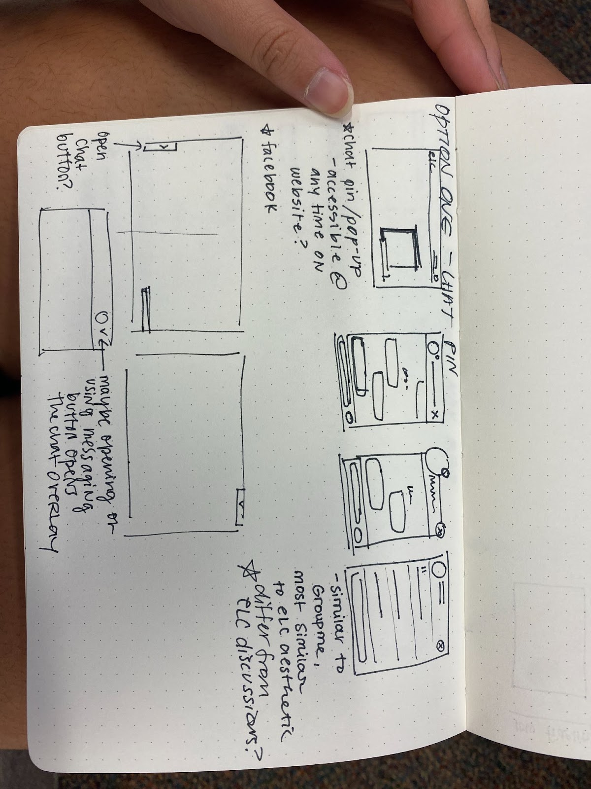 
             
            Wireframe 2: 
             
            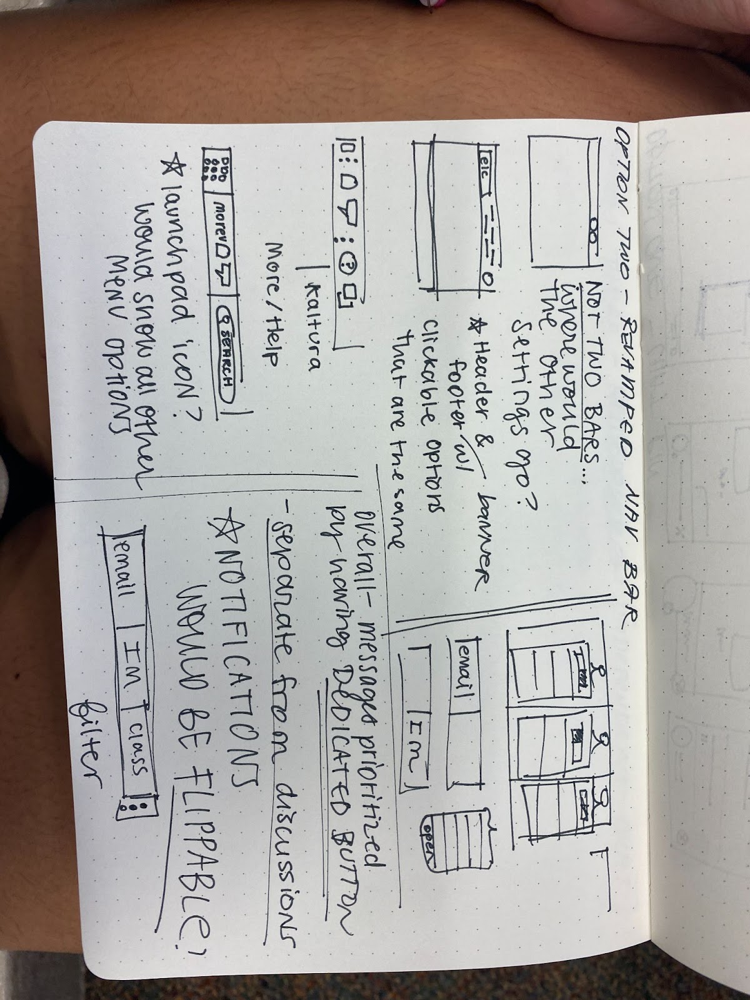 
            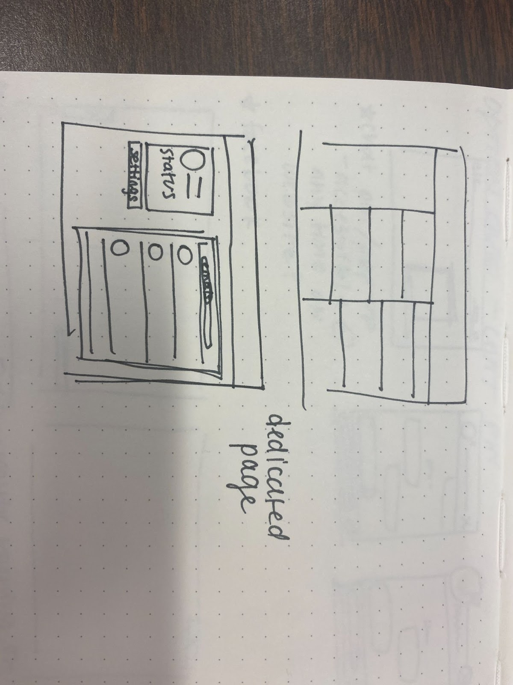 
            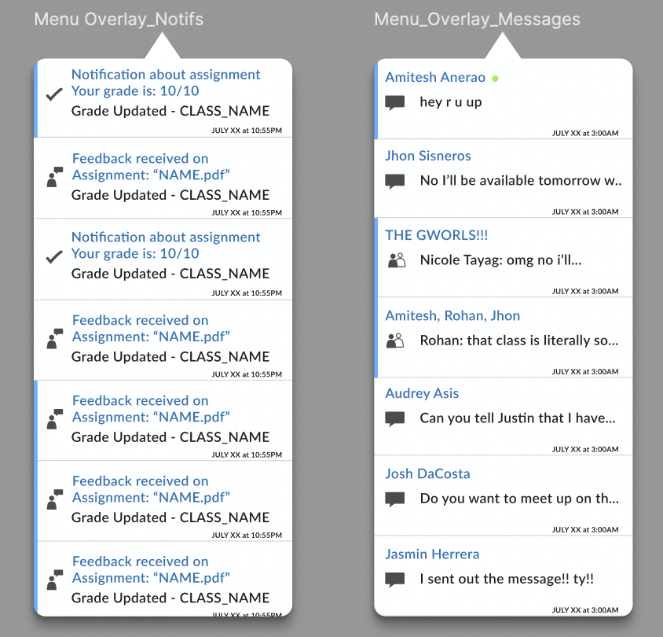 
             
            Wireframe 3: 
             
            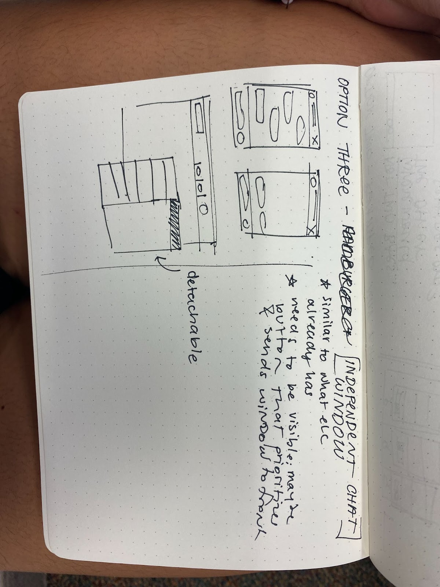

          2. User Story - Personalization & Settings:

            We decided that redesigning the appearance and notification settings could directly relieve some current issues with the application. With more options for customizing the text styles and display theme, we figured the user could better read the information on the screen. With a more organized settings menu for changing the notifications, we hope that the user will have an easier and quicker experience when responding to messages they have received. Our group looked to successful messaging apps such as GroupMe and Discord for examples of customization that are currently lacking from the eLC messaging platform, and then we decided which features would make the most sense for students communicating with each other. The first wireframe for this user story implements a dark mode and font customization which can help the user interpret their received messages. Adding a dark mode feature to eLC could increase the contrast on the screen, and therefore promote a better interpretation of the content on the screen (Barros). The second wireframe combines notifications and appearance settings so users can more easily navigate to the settings they wish to change. The third wireframe utilizes the same horizontal navigation bar while also combining different sections of the settings menu. 
             
            Wireframe 1: 
             
            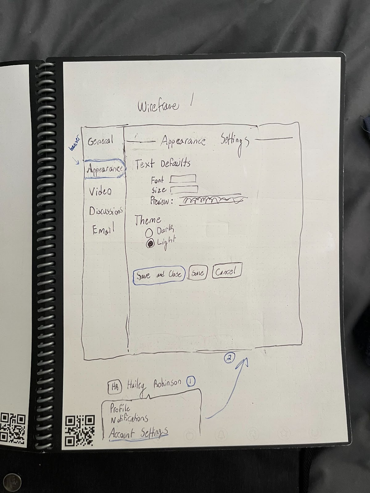 
             
            Wireframe 2: 
             
            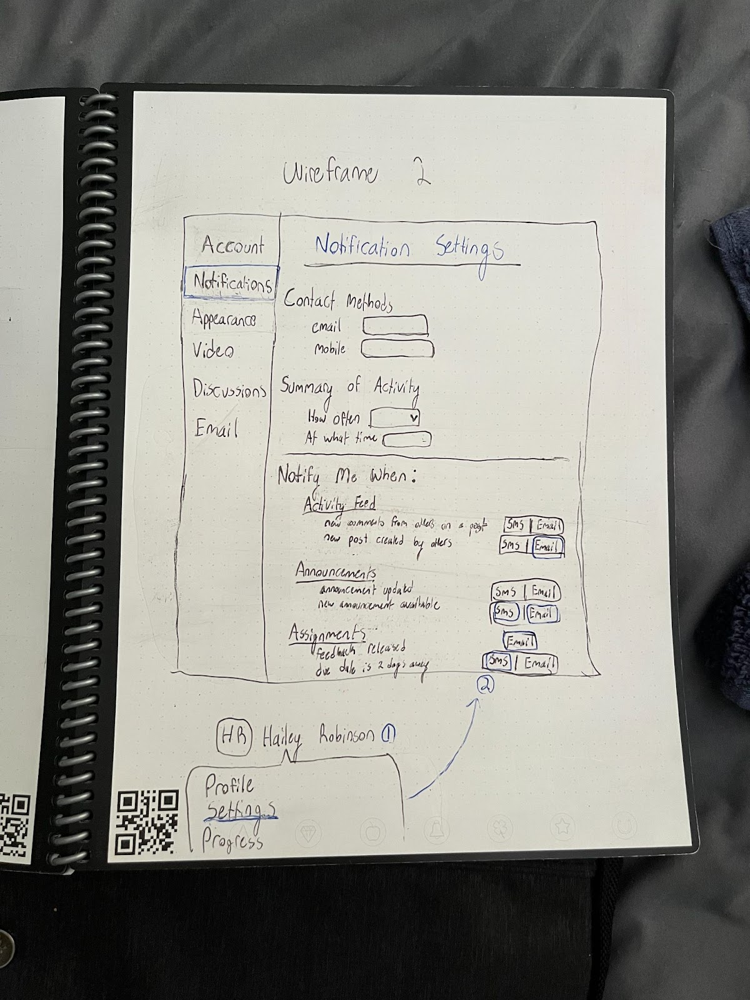 
             
            Wireframe 3: 
             
            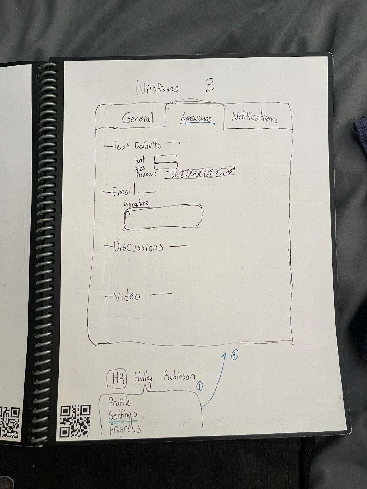

          3. User Story - Pinning & Marking Messages:

            For our wireframes, we took design inspiration from discord because multiple studies recently have found that discord increases student interaction and helps students in situations where they previously would not have been able to get help. In the study by Jorge Ramon 98% of students felt that they got more help using discord than they would have. Features that help facilitate this are a class list organised by people who are online as well as dedicated channels for questions to professors or teaching assistants. The background, font and text color choices were based on the UGA style guidelines. The popular messages are sorted from most to least popular in the time period.  The pinned messages are sorted with the most recent first for ease of access to recent important messages. 
             
            <iframe style="border: 1px solid rgba(0, 0, 0, 0.1);" width="800" height="450" src="https://www.figma.com/embed?embed_host=share&url=https%3A%2F%2Fwww.figma.com%2Ffile%2F4U99U74RZLcey9L1rMj5sZ%2FWireframes-Part-B---Pinning-%2526-Marking-Messages" allowfullscreen></iframe>

          4. User Story - Communicating with the Instructors:

            In all three of my wireframes, we decided to include an option for inquiring solutions from professors and fellow students, and an alternative office hour button to schedule a time with the professor to ask more in depth about what the student needs help with. The inclusion of the forum allows for more instantaneous support, which according to the article by Quan-Hasse, is a efficient and productive way for modern day students to interact with each other and get support from the instructors. 
             
            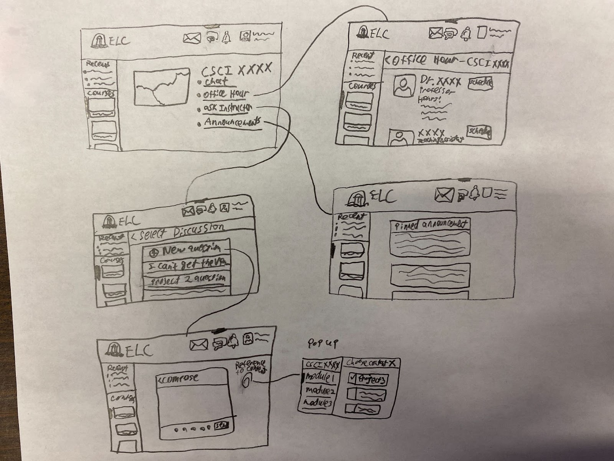 
             
            After brainstorming ideas for the wireframes for this user story, we’ve settled on three. The first we settled on is having the messaging be a page, with a hamburger style scroll on the very left, for the user to choose either a recent conversation or a class, then allow for the user to choose between messaging, scheduling a meeting with a professor, or sending forum style posts for either the professor or the entire class to ask questions about certain assignments.
The second idea is to allow for a messaging, schedule office hours, and forum style posts to be available as new tabs on eLC. This would allow for minimal changes to the existing platform, keeping the current users from having to relearn how to use eLC. 
             
            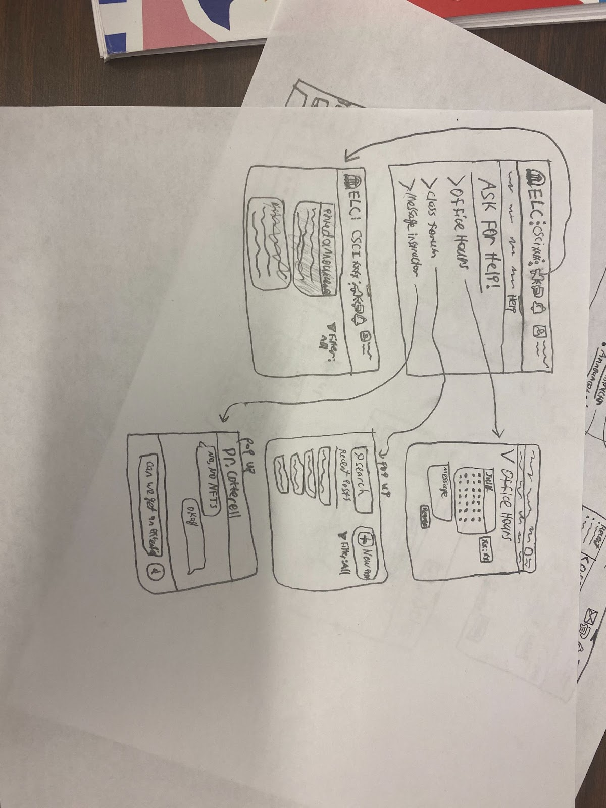 
             
            The third idea is to allow for the students to be able to send messages to the entire class, request assistance, and schedule for office hours on an assignment page. This allows for the student to easily be able to track which conversations they have had with the professor regarding a specific project, rather than having to dig through the mountain of disorganized messages, and allows for the instructors to have context on what the student is confused about. 
             
            <iframe style="border: 1px solid rgba(0, 0, 0, 0.1);" width="800" height="450" src="https://www.figma.com/embed?embed_host=share&url=https%3A%2F%2Fwww.figma.com%2Ffile%2F2tJSeME66BP0hiPP33QeuG%2FWireframe-3-Part-B---Asking-for-Help%3Fnode-id%3D0%253A1" allowfullscreen></iframe>

## C. Detailed Designs:

          1. User Story - Instant Messaging:

            The higher-fidelity mockup we decided to use was the one with the filtered notifications, with a slider that can quickly show different types of notifications. 
             
            <iframe style="border: 1px solid rgba(0, 0, 0, 0.1);" width="800" height="450" src="https://www.figma.com/embed?embed_host=share&url=https%3A%2F%2Fwww.figma.com%2Ffile%2FsU8ikCmeI1ibpL8or8LXMj%2FPrototype-Part-C---Instant-Messaging" allowfullscreen></iframe> 
             
            We thought that this was a unique way to filter the high amount of types of notifications eLC has to offer. 
             
            For instance, it would show notifications that the user hadn’t read yet, it has better signifiers that show what type of group it is – more on that in a second– and a clear filter switch and “See all…” linke at the bottom that takes the user to the dedicated chat page. In our theoretical approach to different types of groups, we wanted to have group messages that were made by students themselves, individual messages, and also automatically created class text groups that include the professor. Creating these signifiers that show which type of group it is helps dilute the fear of sending something wrong, especially since people often feel pressured to text a certain way. This is especially true if there are strangers or a professor inside the group message (Ly 133-134, 136). 
             
            We also believed this version of access point to the chat was the best for not destroying the aesthetic of eLC; the notifications retain relatively the same appearance. The chat pin option would be completely different from the rest of the website since it’d constantly be in the front of content that students may be trying to read. The detached chat option could easily distract and detract from the main website itself, and could get lost behind several windows.

          2. User Story - Personalization & Settings:

            After researching successful settings menus, we came to the conclusion that a vertical navigation bar would best aid the users in scrolling and returning to the options they are searching for. Because of this, we decided that wireframe 2 best suits our proposed solution; by combining the layout of wireframe 2 and the text settings in wireframe 1, we believe the user will have more success customizing their messaging experience in eLC. In the journal Issuers in Informing Science and Information Technology, the researchers state “Although the Student-net is highly personalized, 23% of the students performed additional personalization. This is an indication that, regardless of how good automatic personalization is, there is still a need to allow the user to additionally personalize the portal according to his or her individual needs and wishes” (Popovic, 322). Our group concluded that the average user would also value quick access to information and even quicker messaging. By centralizing information and connecting people for meaningful collaboration, online portals can improve efficiency through thoughtful communication (Voth, 2002). 
             
            <iframe style="border: 1px solid rgba(0, 0, 0, 0.1);" width="800" height="450" src="https://www.figma.com/embed?embed_host=share&url=https%3A%2F%2Fwww.figma.com%2Ffile%2FgPDw07LgVQQBdJzDD3t91F%2FMockup-Part-C---Personalization-%2526-Settings" allowfullscreen></iframe>

          3. User Story - Pinning & Marking Messages:

            We chose the design with smaller drop-down windows because it was less invasive and pushed readers to use the jump button to automatically move back in the text log. While the pop-up menu design has better ease of access for filter settings, it makes users search messages in a separate window and is much more invasive. The pop-up window also locks the user out of using any other panels, which can be helpful for finding important posts. 
             
            <iframe style="border: 1px solid rgba(0, 0, 0, 0.1);" width="800" height="450" src="https://www.figma.com/embed?embed_host=share&url=https%3A%2F%2Fwww.figma.com%2Ffile%2FyFBt3ykcJ9e6a5m2kcCkSE%2FMockup-Part-C---Pinning-%2526-Marking-Messages" allowfullscreen></iframe>

          4. User Story - Communicating with the Instructors:

            After looking through the wireframes for this specific user story, we’ve decided to move on forward with the third idea. Although our first wireframe design is very logical, it’s very clunky and takes many clicks to navigate. This and having the webpage change so many times – once per click – is very dramatic, and would likely take long to load on slower networks. We decided to ditch the second draft, because we realized that the only reason we had for making the wireframe was to keep the status quo, and that’s not the best way to go. The third design adds feature to a page that was originally very empty, adding more utility to a page that’s otherwise only used for submissions and at times, downloading files for an assignment. This also avoids creating “featuritis” in other pages, where there are already an overwhelming number of tabs and choices. We decided that this, along with the benefits described in part B for this design, is enough for us to proceed with this mockup. 
             
            <iframe style="border: 1px solid rgba(0, 0, 0, 0.1);" width="800" height="450" src="https://www.figma.com/embed?embed_host=share&url=https%3A%2F%2Fwww.figma.com%2Ffile%2FTIABrpSGLJK5nGGdJ7JbOi%2FPrototype-Part-C---Asking-for-Help%3Fnode-id%3D0%253A1" allowfullscreen></iframe>

## D. Summary Video:

            
<iframe width="560" height="315" src="https://www.youtube.com/embed/5GPN6S-26O0" title="YouTube video player" frameborder="0" allow="accelerometer; autoplay; clipboard-write; encrypted-media; gyroscope; picture-in-picture" allowfullscreen></iframe>

## Citations:

            Arifianto, Muhammad Lukman, and Iqbal Fathi Izzudin. “Students' Acceptance of Discord as an Alternative Online Learning Media.” International Journal of Emerging Technologies in Learning, vol. 16, no. 20, 2021, pp. 179–195. 
             
            Finnegan, Matthew. “Slack Targets Non-Tech Users with UI Design Tweaks.” 18 Mar. 2020, https://search.ebscohost.com/login.aspx?direct=true&AuthType=ip,shib&db=bth&AN=142907834&site=eds-live&custid=uga1. Accessed 27 June 2022. 
             
            Ly, Quang C. “The Case for GroupMe: Rhetorical Thinking Thrives Among Students Using App.” Journal of Literacy & Technology, 2022, pp. 110–158., https://search.ebscohost.com/login.aspx?direct=true&AuthType=ip,shib&db=ehh&AN=144943452&site=eds-live&custid=uga1. 
             
            Quan-Haase, Anabel. “University Students’ Maintenance of Social Ties: Using and Integrating Modes of Communication on Campus.” Conference Papers -- American Sociological Association, 2007 Annual Meeting 2007, p. 1. EBSCOhost, https://search.ebscohost.com/login.aspx?direct=true&AuthType=ip,shib&db=sih&AN=34597271&site=eds-live. 
            Quan-Haase, Anabel. “Instant Messaging on Campus: Use and Integration in University Students’ Everyday Communication.” Information Society, vol. 24, no. 2, Apr. 2008, pp. 105–15. EBSCOhost, https://doi.org/10.1080/01972240701883955. 
             
            Uddin, Shahadat, et al. “The Impact of Study Load on the Dynamics of Longitudinal Email Communications among Students.” ScienceDirect, Mar. 2014, https://doi.org/10.1016/j.compedu.2013.11.007. Accessed 28 June 2022. 
             
            Fonseca Cacho, Jorge, "Using Discord to Improve Student Communication, Engagement, and Performance" (2020). UNLV Best Teaching Practices Expo. 95. https://digitalscholarship.unlv.edu/btp_expo/95 
             
            Popovic, Ales, et al. “Web Triad: The Impact of Web Portals on Quality of Institutions of Higher Education - Case Study of Faculty of Economics, University of Ljubljana, Slovenia.” Issues in Informing Science and Information Technology, Informing Science Institute, 2005, https://www.informingscience.org/Publications/830?Source=%2FJournals%2FIISIT%2FArticles%3FVolume%3D0-0. 
             
            Voth D. (2002). Why Enterprise Portals are the Next Big Thing. E-learning. October 2002, 25-29 
             
            Barros, Pedro. “Darkmode and the Benefits for the User Experience.” Venturus, 29 Sept. 2021, https://www.venturus.org.br/en/darkmode-and-the-benefits-for-the-user-experience/#:~:text=According%20to%20a%20survey%20carried,Dark%20Mode%20on%20their%20devices.

## Figures:

            Figure 1 - Syllabus of a professor urging students to use 3rd party platforms like email and Calendly for communication: 
            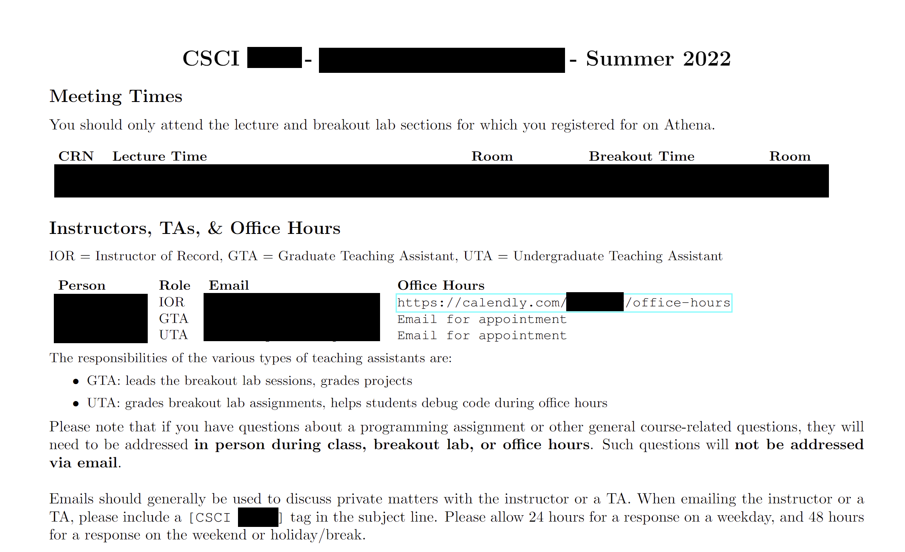 
             
            Figure 2 - Screenshot of another professor using Piazza for forum and inquiries: 
            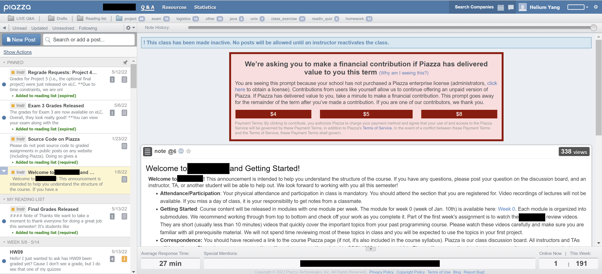

## Assets & Color Pallets:

            All assets that were not made by our group are sourced from:
            > <a href="https://brand.uga.edu/">brand.uga.edu</a>
            > <a href="https://uga.edu/">uga.edu</a>

#### Milestones

- [Milestone 1: Problem Proposal](/milestone1.md)
- [Milestone 2: Definition & Related Work](/milestone2.md)
- [Milestone 3: Design Alternatives](/milestone3.md)
- [Milestone 4: Prototyping & Testing](/milestone4.md)
